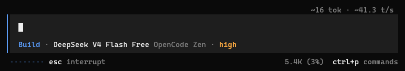
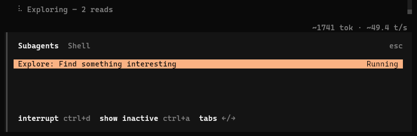

# opencode2-tps

Live token-throughput indicator for the OpenCode 2 TUI prompt composer.

While a session streams, the top right of the composer shows estimated observable tokens and throughput: `~1712 tok · ~51.5 t/s`

When OpenCode reports terminal usage, the token count becomes exact while TPS remains approximate, for example `1715 tok · ~51.5 t/s`. The result freezes until the next run starts. Nothing is shown on the home screen, or before the first observable output.

<p align="center">
  
</p>

## Install

Built against the OpenCode 2 preview. The earliest known compatible beta is `0.0.0-beta-17595`; the latest tested beta is `0.0.0-beta-17639`. The TUI plugin API is still moving, so a much newer or older build may drop the indicator without an error. If the figure never appears, check your version first.

Add the package to `~/.config/opencode/cli.json`:

```json
{
  "plugins": ["opencode2-tps"]
}
```

To set options, use the object form:

```json
{
  "plugins": [
    {
      "package": "opencode2-tps",
      "options": { "display": "tps", "refreshHz": 12 }
    }
  ]
}
```

A running TUI picks up `cli.json` changes immediately. On first use it installs the package into its own cache, `~/.cache/opencode/packages/opencode2-tps/` on Linux.

That cache is keyed on the entry text and is never refreshed once it exists, so a restart alone will not pick up a new release. To upgrade, delete the directory and restart:

```sh
rm -rf ~/.cache/opencode/packages/opencode2-tps
```

To pin a version instead, put the range in the entry — `"opencode2-tps@0.1.0"`. Every distinct entry gets its own cache directory.

The plugin ID is `opencode2.tps`. To switch it off without losing the entry and its options, add `"-opencode2.tps"` after it:

```json
{
  "plugins": [
    {
      "package": "opencode2-tps",
      "options": { "display": "tps", "refreshHz": 12 }
    },
    "-opencode2.tps"
  ]
}
```

## Configuration

The defaults are usable as they are. For the full option list, the ranges and more examples, see [Configuration](docs/configuration.md).

## How it works

While output streams, the plugin estimates tokens from observable UTF-8 bytes at a default of 4.75 bytes per token and calculates a bounded rolling delivery rate. Complete text, reasoning, and tool-input events reconcile buffered or missed deltas without creating artificial live-rate spikes.

At the end of each model step, OpenCode's reported output and reasoning usage replaces the byte estimate. Settled TPS divides those exact tokens by observed step spans ending at the final model-content boundary, which excludes later local tool execution and time between model calls.

TPS is always approximate (`~`) because OpenCode does not expose token-level timestamps. Proprietary reasoning may be encrypted or represented only by a short summary, and some providers buffer tool arguments until completion. During those opaque intervals the live rate holds or becomes unavailable instead of continuously falling. Opaque provider state is never counted by byte length.

For more detail, see [Architecture](docs/development.md#architecture).

## Sub-agents

Every output event carries the ID of the session that produced it, so each session is measured on its own.

A sub-agent streams under its own child session ID. While it works, the orchestrator's number stops moving and holds the average of the output the orchestrator produced before delegating. Open the sub-agent's session to watch its live throughput.

<p align="center">
  
</p>

## Development

To work on the plugin, see [Development](docs/development.md). To publish a new version, see [Release](docs/release.md).

## License

MIT — see [LICENSE](LICENSE).
